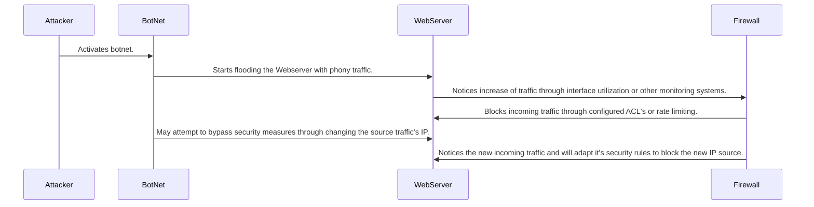

Step 1: Once the attacker has a target, he activates numerous hosts. 
Step 2: These hosts start sending traffic to one destination with the goal of denying service. 
Step 3: The Web Server will notice on the increase of traffic. At first this may cause latency or denial of service. 
Step 4: The firewall will start it's defensive measures or may have aleady started through configured ACL's or rate limiting the offending users. 
Step 5: If the attack is unsuccessful, the attacker can alter the IP in which the traffic is coming from.
Step 6: This sends the firewall back into defensive mode to stop the traffic. 